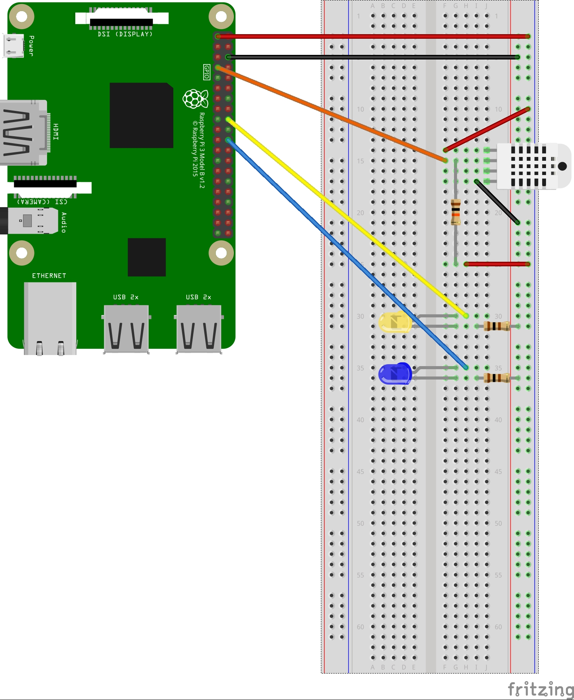

# RPi_DHT22 จดเฉยๆ ถ้ารื้อแล้วกูจำไม่ได้

ทดสอบวัดอุณภูมิกับความชื้นโดยเซ็นเซอร์ DHT22 กับ Raspberry Pi 3 Model B ใช้ Python 3.6.2 เขียนโค้ด

## วิธีต่อวงจร
อิดอกของเยอะเว่อตามนี้ค่ะ
- Raspberry Pi 3 Model B
- Breadboard (ไซส์ไหนก็เรื่องของมึง)
- DHT22
- LED สีเหลือง (สีไหนก็เรื่องของมึงกูจะเอาสีนี้)
- LED สีน้ำเงิน (สีไหนก็เรื่องของมึงกูจะเอาสีนี้)
- ตัวต้านทาน 10kΩ 1 ตัว
- ตัวต้านทาน 100Ω 2 ตัว
- สายจั๊ม male-male 3 ตัว
- สายจั๊ม male-female 5 ตัว

แล้วก็ต่อวงจรตามนี้




อิดอกรูปใหญ่ชิบหายลดขนาดไม่เป็น ช่างแม่ง

## วิธีลง

Install Raspbian LITE
https://www.raspberrypi.org/downloads/raspbian/

Update
```
sudo apt-get update
```

ลง Python
```
sudo apt-get install build-essential python-dev
```

มึงอย่าลืมลง Git ถ้ามึงไม่ลงก็ใช้ไม่ได้อิผี กูลืมมาแล้ว
```
sudo apt-get install git
```

Clone ของคนอื่นมาอีกที
```
git clone https://github.com/adafruit/Adafruit_Python_DHT.git
```

Clone แล้วเข้าไปลงโปรแกรมด้วย
```
cd Adafruit_Python_DHT
sudo python setup.py install
```

## วิธีใช้

Clone ไปค่ะ หรือจะก๊อปไปก็ได้แล้วแต่เลย แล้วก็เข้าไป Floder ที่วางไว้ แล้วก็เรียกใช้งาน
```
python dht22.py
```

หลังจากนั้นถ้าอุณหภูมิเปลี่ยนไฟเหลืองจะติด ถ้าความชื้นเปลี่ยนไฟน้ำเงินจะติด

## อ้างอิง
* https://github.com/adafruit/Adafruit_Python_DHT.git
